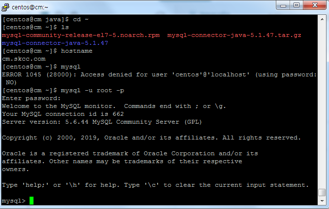
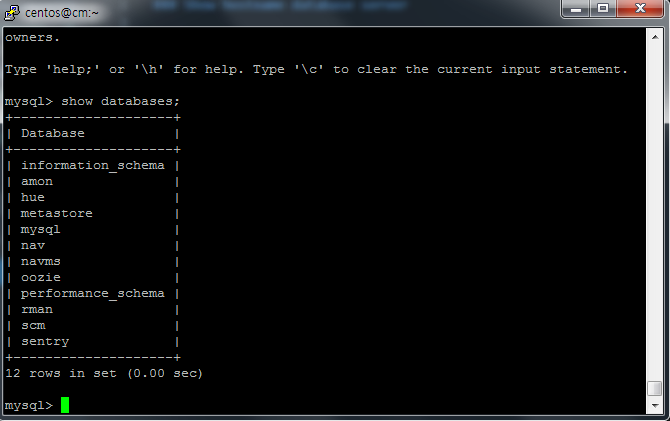
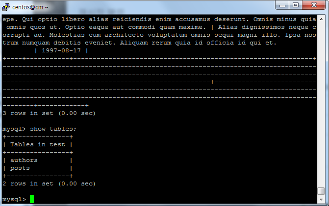

## MySQL 설치 및 설정

### Show hostname database server

### Show database server version

### List all the databases in the server

### create sample tables and grant user

#### Databases, User 생성 및 권한 부여
<pre>
CREATE DATABASE test;

create user 'training'@'localhost' identified by 'training';

grant all privileges on *.* to 'training'@'localhost';

FLUSH PRIVILEGES;
</pre>

#### 샘플 sql 전송 및 mysql에 로드
<pre>
pscp d:/authors-23-04-2019-02-34-beta.sql centos@13.124.12.181:/home/centos
pscp d:/posts23-04-2019-02-44.sql centos@13.124.12.181:/home/centos

source /home/centos/authors-23-04-2019-02-34-beta.sql;
source /home/centos/posts23-04-2019-02-44.sql;

</pre>

## Extract tables authors and posts from the databases and create Hive tables.
