### List your instance ip and DNS name

<pre>
ifconfig
cat /etc/resolv.conf
</pre>
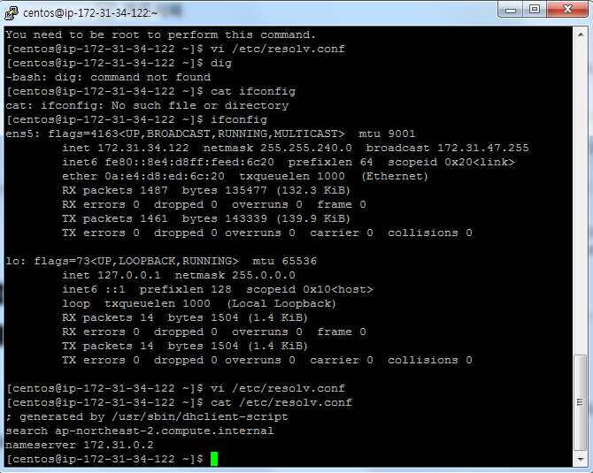
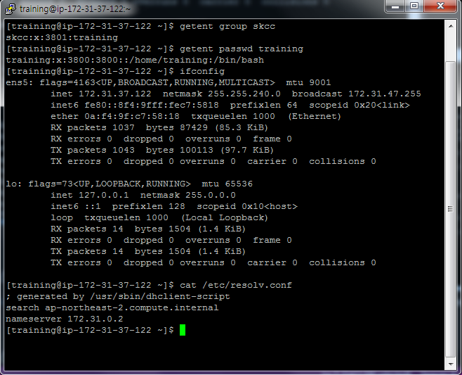
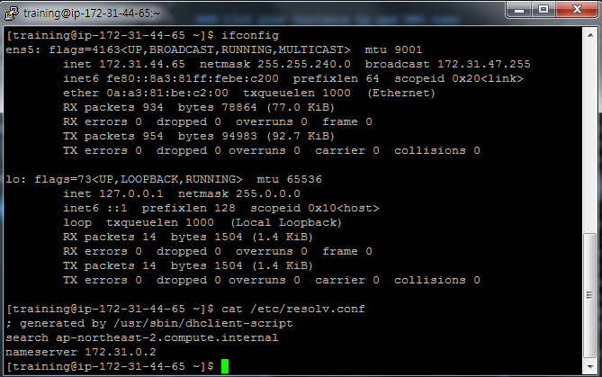
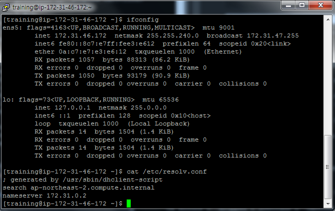
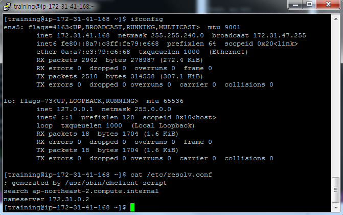

### List the Linux release
<pre>
 cat /etc/redhat-release
</pre>
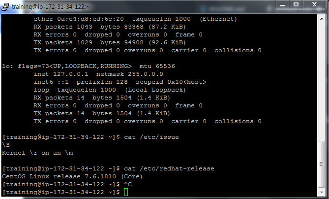

### List file system capacity(master node)
<pre>
 df -h
</pre>
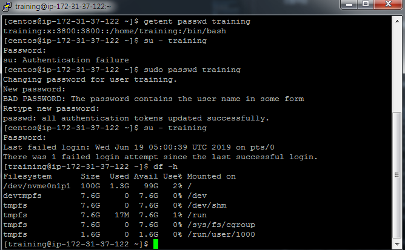

### List command & output for yum repolist enabled
<pre>
yum repolist
</pre>
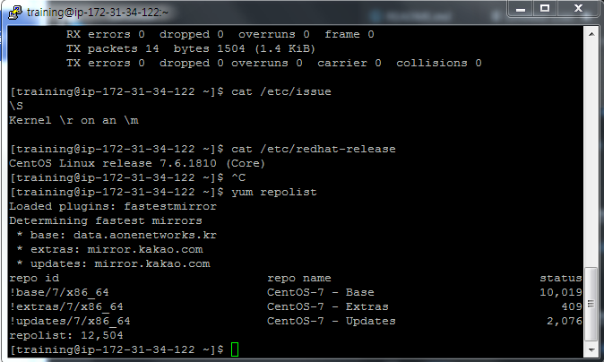

### List the /etc/passwd for training
<pre>
cat /etc/passwd
</pre>
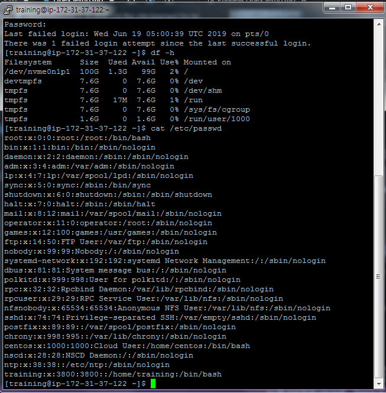

### List the /etc/group for skcc
<pre>
cat /etc/group
</pre>
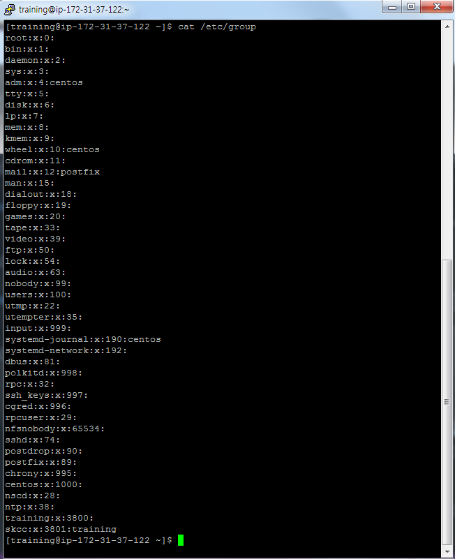

### List output the flowing commands
<pre>
getent group skcc
getent passwd training
</pre>
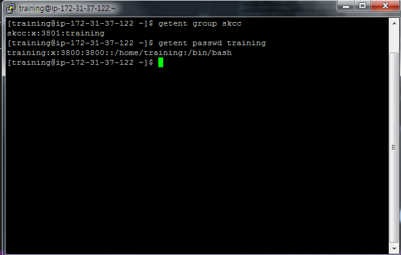

