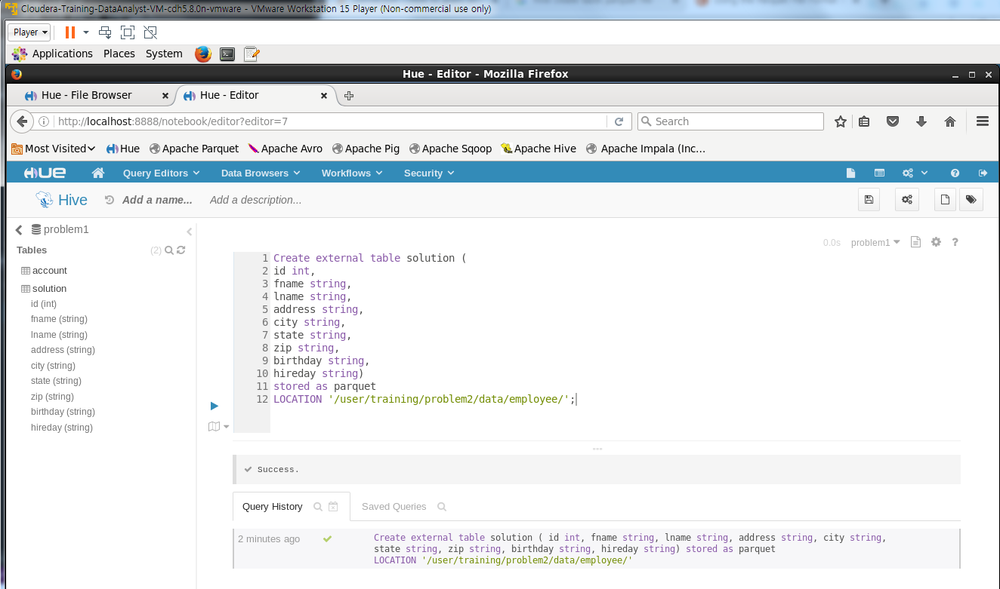

## Problem 2

<pre>
Create external table solution (
id int,
fname string,
lname string,
address string,
city string,
state string,
zip string,
birthday string,
hireday string)
stored as parquet
LOCATION '/user/training/problem2/data/employee/';

</pre>

